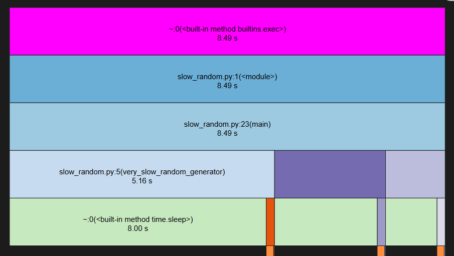
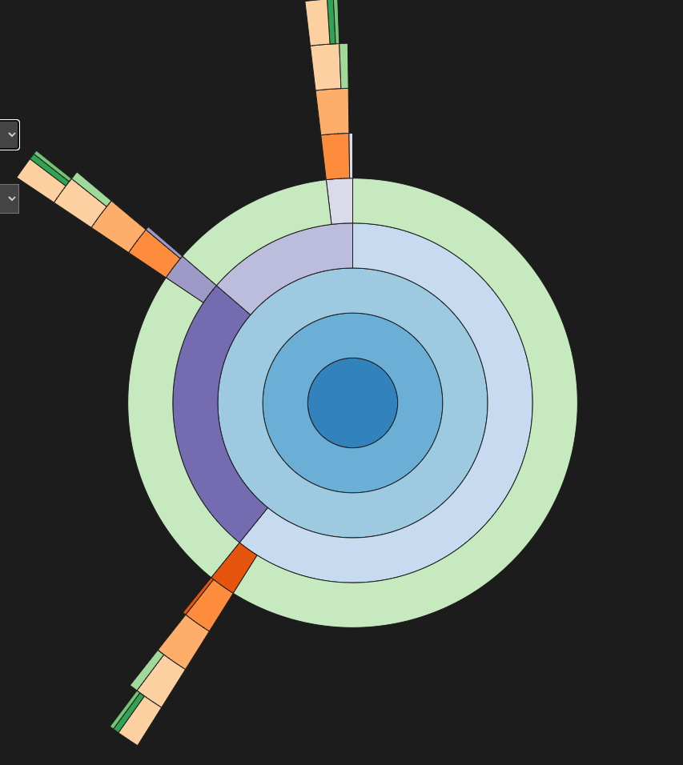

# Profiling Code
* way to measure the performance of your code
* params like: execution time, memory usage, CPU usage, etc.
* identify bottlenecks and optimization opportunities

## cProfile
* built-in Python module for profiling code
* usage: `python -m cProfile main.py`
* expect results like:
```
7 function calls in 45.005 seconds

Ordered by: cumulative time

ncalls  tottime  percall  cumtime  percall filename:lineno(function)
    1    0.000    0.000   45.005   45.005 {built-in method builtins.exec}
    1    0.000    0.000   45.005   45.005 main.py:1(<module>)
    1   45.005   45.005   45.005   45.005 main.py:10(factorial)
    2    0.000    0.000    0.000    0.000 {built-in method builtins.print}
    1    0.000    0.000    0.000    0.000 {method 'disable' of '_lsprof.Profiler' objects}
    1    0.000    0.000    0.000    0.000 main.py:3(add)
```

## Scalene
* ... is also cool
* `scalene main.py`

## Visualization
* `tuna`
* `snakeviz`

## Example
* `python -m cProfile -o slow_random.prof slow_random.py`
* `snakeviz slow_random.prof `
* go to web browser and see the results
* resulting plots will look like this:
<!-- md-dead-link-check: off -->
  
... or this:  
  
<!-- md-dead-link-check: on -->

* each function is represented as a rectangle, with the size of the rectangle proportional to the time spent in that function. You can set given rectangle as root and see the time spent in it's sub-functions

## References
* [quick yt tutorial](https://www.youtube.com/watch?v=BZzb_Wpag_M)
* [some tutorial]()
* [daily dev list](https://daily.dev/blog/top-7-python-profiling-tools-for-performance)
* [scalene](https://github.com/plasma-umass/scalene)
* [snakeviz](https://github.com/jiffyclub/snakeviz/tree/master)
